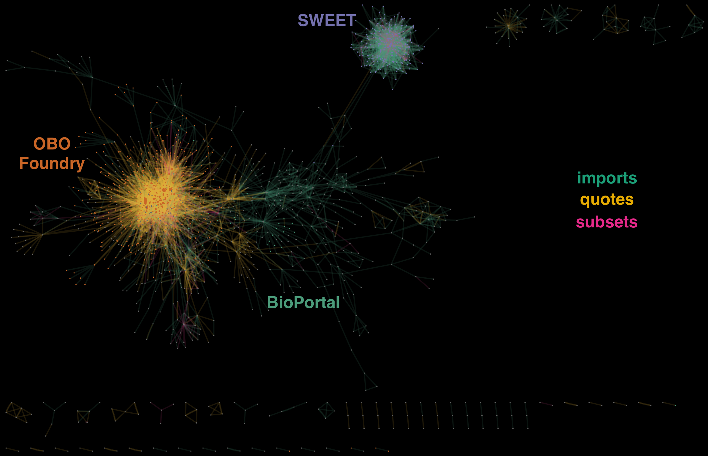

# Virtual Ontology Observatory

The Virtual Ontology Observatory (VOO) collects 2,186 ontologies from six different ontology indexing portals to create a knowledge graph containing all accessible and loadable ontologies. The reuse of ontologies is foundational to the Semantic Web, but methods of reuse vary between domains, projects, and communities. We analyzed the use of three different ontology reuse approaches: OWL’s import semantics, subsetting ontologies and importing those subsets, and quoting individual terms from one ontology to another. 64% of ontologies engage in ontology reuse, with many ontologies using multiple approaches, and 44% of ontologies are reused by other ontologies. Additionally, 76% of ontologies either reuse or are reused by other ontologies. This suggests that the ethos of reuse is generally well-accepted in ontology engineering communities. There are significant differences in reuse between communties of practice, and that larger ontologies are usually quoted or subsetted, while smaller ones are subsetted. We provide an archive of VOO as well as the code needed to rebuild it.

## Available Resources

| Resource | Type | URL |
|-|-|-|
| Summary Resource Page (This page) |  Web Site |  (http://purl.org/whyis/voo) |
| Ontology Sky Chart |  Visualization |  (http://purl.org/whyis/voo/skychart) |
| Ontology Sharing Network |  Cytoscape Network |  (http://purl.org/whyis/voo/skychart/data/networks.js) |
| Knowledge Graph Dump |  Data |  (http://purl.org/whyis/voo/download) |
| Code repository |  Code |  (https://github.com/tetherless-world/voo) |

## Ontology Sources

We loaded ontologies from several sources, detailed below:

| Source | Listed | Loaded |
|-|-|-|

[{{source.label}}]({{source.website}}) | {{source.listed}} | {{source.loaded}} |


## Reuse Summary Statistics

| | Reuser | (%) | Reused | (%) | Either | (%) |
|-|--------|-----|--------|-----|--------|-----|
| Quote | 845 | (39%) | 352 | (16%) | 978 | (45%) |
| Import | 691 | (32%) | 711 | (33%) | 989 | (45%) |
| Subset | 310 | (14%) | 71  | (3%)  | 365 | (17%) |
| Any | 1406 | (64%) | 969 | (44%) | 1661 | (76%) |

## Top Reused Ontologies

The most re-used ontologies through *owl:imports* are:

| Ontology | Imports |
|-|-|

[{{source.label}}]({{source.ontology}}) | {{source.count}} |


The most re-used ontologies through MIREOT-style term quoting are:

| Ontology | Uses |
|-|-|

[{{source.label}}]({{source.quoted}}) | {{source.indegree}} |


## Sky Chart of Ontology Reuse

We have prepared a web visualization of ontology reuse. Note: it is a large graph and can be very slow to load and manipulate.

